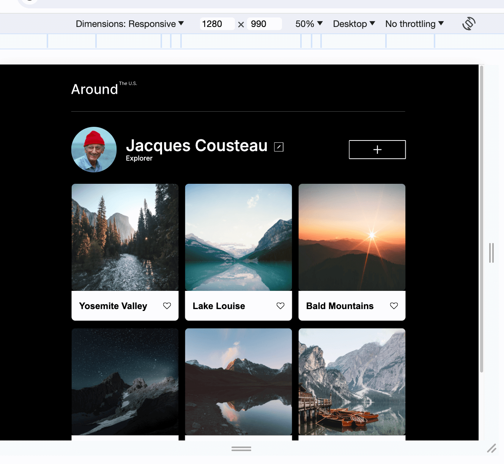
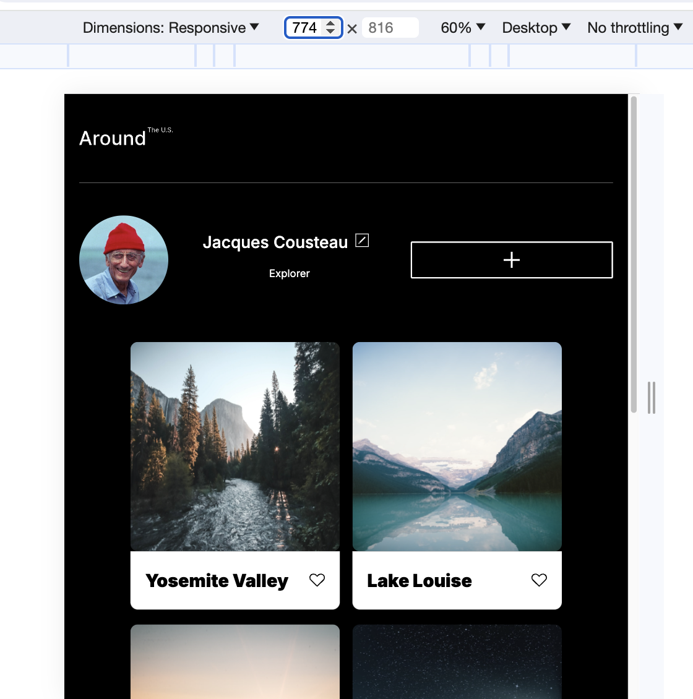
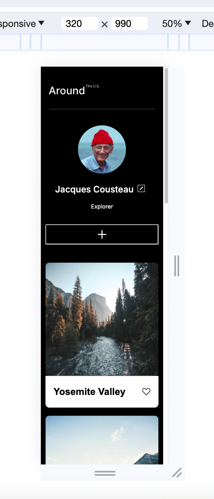

# Project 3: Around The U.S.

### Overview

- Project name.
- A description of the project and its functionality.
- A description of technologies and technniques used.
- Pictures (screenshots).
- Video Sprint 3

**Project: "Around The US"**

**A description of the project and its functionality.**

It is an interactive page where users can add and remove pictures, like images of other users and make a few adjustments to their own profile.
This project is made so all the elements are displayed correctly on popular screen sizes.

On working on the project used web design created on Figma. Figma design that provides layouts for mobile (320px) and desktop (1280px).  
The webpage is responsive, the width of the content area is change depending on the width of the browser window, and there is haven't any horizontal scrolling.  
The minimum screen width supported is 320px, which have one card per row. The maximum window width is 1280px, meaning three cards per row — 880px for the content and 200px of empty space on each side. Even if the users browser window is wider, the content area will not get any wider. For tablet screen widths, the design will be the same as for desktop but with two cards in a row.

**A description of technologies and technniques used.**

- [Link to the project on Figma](https://www.figma.com/file/ii4xxsJ0ghevUOcssTlHZv/Sprint-3%3A-Around-the-US?node-id=0%3A1)

To create this web-page the follwing technologies and technniques were used:

1. HTML and CSS;
2. For this project, was used the BEM file structure;
3. Flexbox and grid layouts are used in the project;
4. Media queries and breakpoints;
5. DevTools to be ensure, that the web-page should scale as smoothly as possible;
6. All fonts used in this project are from the Inter family. The necessary font files and @font-face declarations were added in the project’s vendor directory;
7. A line-height was calculated by dividing line-height by font-size;
8. In some parts, for example cards, text was hiding by set overflow CSS properties;  
   9 [Link to the project on GitHub](https://github.com/Goldshtern/se_project_aroundtheus.git)

**Pictures (screenshots)**

Grid.

Flex and grid.

BEM structure.

1280px

775px

320px

**Video Sprint 3**

Sorry it was wrong video
